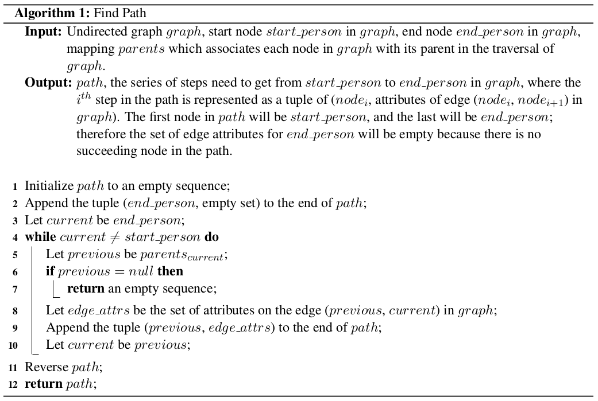

# Kevin Bacon Writeup Solutions

## 4.A. Find Path Recipe

**Algorithm: Find Path**

**Input:**
- Undirected graph *graph*
- Start node *start_person* in *graph*
- End node *end_person* in *graph*
- Mapping *parents* which associates each node in *graph* with its parent in the traversal of *graph*

**Output:** *path*, the series of steps needed to get from *start_person* to *end_person* in *graph*, where the $i^{th}$ step in the path is represented as a tuple of (*node_i*, attributes of edge (*node_i*, *node_{i+1}*) in *graph*). The first node in *path* will be *start_person*, and the last will be *end_person*; therefore the set of edge attributes for *end_person* will be empty because there is no succeeding node in the path.

1. Initialize *path* to an empty sequence
2. Append the tuple (*end_person*, empty set) to the end of *path*
3. Let *current* be *end_person*
4. **while** *current* ≠ *start_person* **do**
   1. Let *previous* be *parents[current]*
   2. **if** *previous* = null **then**
      - **return** an empty sequence
   3. Let *edge_attrs* be the set of attributes on the edge (*previous*, *current*) in *graph*
   4. Append the tuple (*previous*, *edge_attrs*) to the end of *path*
   5. Let *current* be *previous*
5. Reverse *path*
6. **return** *path*

---

## 4.B. Kevin Bacon Game Output

*Note that the paths need not be identical to these, as there may be more than one equally short path between two nodes, but the lengths must be the same.*

**Path from Kevin Bacon to Amy Adams:**
- Kevin Bacon
- *R.I.P.D.*
- Jonathan Retamoza-Davila
- *The Master*
- Amy Adams

**Path from Kevin Bacon to Andrew Garfield:**
- Kevin Bacon
- *Crazy, Stupid, Love.*
- Emma Stone
- *The Amazing Spider-Man 2 / The Amazing Spider-Man*
- Andrew Garfield

**Path from Kevin Bacon to Anne Hathaway:**
- Kevin Bacon
- *R.I.P.D.*
- Robert Masiello
- *Bride Wars*
- Anne Hathaway

**Path from Kevin Bacon to Barack Obama:**
- Kevin Bacon
- *Beyond All Boundaries*
- Justin Long
- *Live Free or Die Hard*
- Barack Obama

**Path from Kevin Bacon to Benedict Cumberbatch:**
- Kevin Bacon
- *Jayne Mansfield's Car*
- Ritchie Montgomery
- *12 Years a Slave*
- Benedict Cumberbatch

**Path from Kevin Bacon to Chris Pine:**
- Kevin Bacon
- *Beyond All Boundaries*
- Chris Pine

**Path from Kevin Bacon to Daniel Radcliffe:**
- Kevin Bacon
- *X-Men: First Class*
- Teresa Mahoney
- *Harry Potter and the Half-Blood Prince*
- Daniel Radcliffe

**Path from Kevin Bacon to Jennifer Aniston:**
- Kevin Bacon
- *My One and Only*
- David Kneeream
- *The Bounty Hunter*
- Jennifer Aniston

**Path from Kevin Bacon to Joseph Gordon-Levitt:**
- Kevin Bacon
- *Jayne Mansfield's Car*
- Ritchie Montgomery
- *Looper*
- Joseph Gordon-Levitt

**Path from Kevin Bacon to Morgan Freeman:**
- Kevin Bacon
- *Jayne Mansfield's Car*
- Ritchie Montgomery
- *Red*
- Morgan Freeman

**Path from Kevin Bacon to Sandra Bullock:**
- Kevin Bacon
- *R.I.P.D.*
- Joe Stapleton
- *The Heat*
- Sandra Bullock

**Path from Kevin Bacon to Tina Fey:**
- Kevin Bacon
- *R.I.P.D.*
- Joe Stapleton
- *The Invention of Lying*
- Tina Fey

---

## 5. Discussion Questions

**1. Computing Graph Diameter:**
To compute the maximum distance between any two nodes in the graph, I would run BFS starting from every node in the graph. Each run of BFS would output a mapping of nodes to their distance from the start node; the diameter of the graph would be the maximum distance value across all of the runs of BFS.

**2. Finding Hubs:**
As was discussed in lecture, a node is connected to another node if there is a path between those nodes. In other words, a node is connected to a component in the graph if it has an edge to that component. Therefore, the hubs in the graph have the most connections to the graph, so they are the nodes of highest degree. To find these actors, I would do the following: set the max degree to 0, and the set of nodes of max degree to an empty set. Iterate over each node `n` in the graph; if the degree of `n` is greater than the max degree seen thus far, update max degree to equal the degree of `n` and reset the set of nodes of max degree to contain only `n`. If the degree of `n` is equal to the max degree, add `n` to the set of nodes of max degree. Otherwise, continue on to the next node, since we've seen a higher degree previously.

**3. Important Movies:**
Movies are important to the structure of the graph if they appear on many of the edges that fall along the shortest paths between nodes in the graph. In particular, those movies that are the sole attribute on edges that are part of the sole shortest path between two nodes are of particular importance, because they connect subsets of the graph that would otherwise be farther removed from each other.

**4. Comparing Kevin Bacon and Stephanie Fratus:**
The majority of the nodes in the graph are a distance of two or less edges from Kevin Bacon, with the maximal distance from Kevin Bacon being 4 — and only a few (< 10%) of the nodes are at this maximal distance of 4. On the other hand, the majority of nodes are 4 or more edges away from Stephanie Fratus, with < 2% of nodes being within two degrees of separation. In fact, some nodes are as far as 5 or 6 edges away from Stephanie Fratus. The higher proportion of first-order (one degree away) connections to Kevin Bacon indicates that he is better connected, which naturally leads to the higher number of connections at the succeeding layers.

In fact, there is an exponential nature to this compounding effect, since actors generally have two or more connections. If the average degree of a node in the graph is n, then having m immediate neighbors will likely yield roughly m×n second degree neighbors, m×n×n third degree neighbors, and so on. Note however that this growth will not continue indefinitely, since the graph contains a finite number of nodes and as the degree of separation increases there will be an increasingly large fraction of connections that are repeats of actors that were seen in earlier layers.
