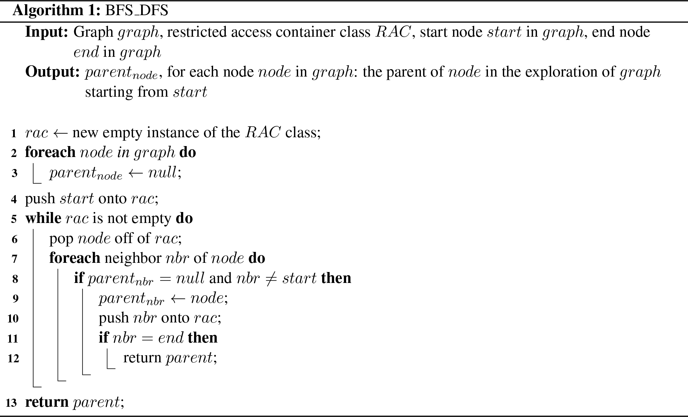
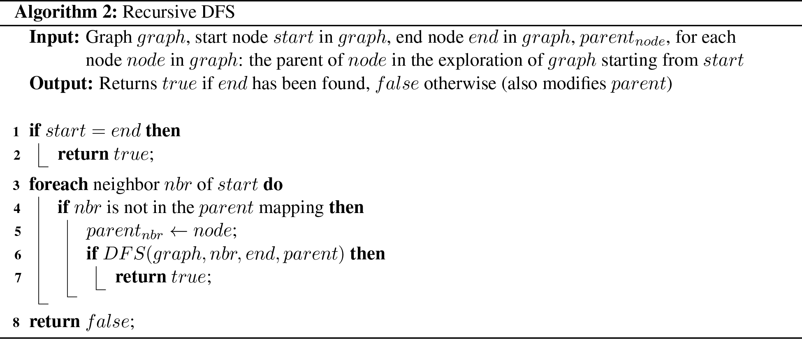
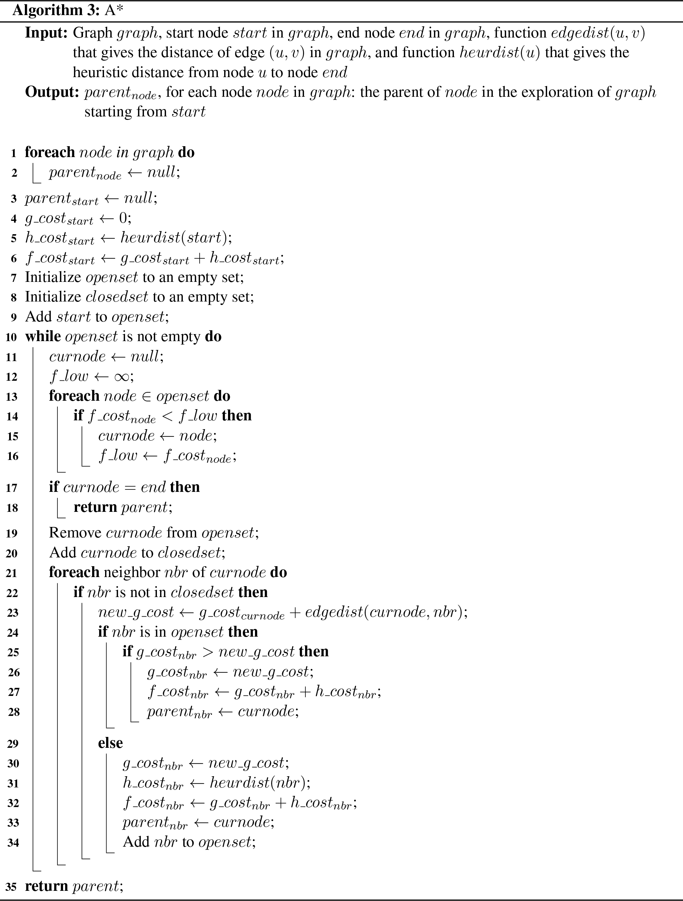

# Map Search Writeup Solutions

## 3.A.i. BFS_DFS Recipe

**Algorithm: BFS_DFS**

**Input:**
- Graph *graph*
- Restricted access container class *RAC* (Queue for BFS, Stack for DFS)
- Start node *start* in *graph*
- End node *end* in *graph*

**Output:** *parent[node]*, for each node *node* in *graph*: the parent of *node* in the exploration of *graph* starting from *start*

1. *rac* ← new empty instance of the *RAC* class
2. **foreach** *node* in *graph* **do**
   - *parent[node]* ← null
3. *parent[start]* ← null
4. push *start* onto *rac*
5. **while** *rac* is not empty **do**
   1. pop *node* off of *rac*
   2. **foreach** neighbor *nbr* of *node* **do**
      - **if** *parent[nbr]* = null **and** *nbr* ≠ *start* **then**
        1. *parent[nbr]* ← *node*
        2. push *nbr* onto *rac*
        3. **if** *nbr* = *end* **then**
           - **return** *parent*
6. **return** *parent*

---

## 3.B. Recursive DFS

### i. Base Cases and Recursive Cases

There are two base cases:

1. When the start node is the end node, then the function should return.
2. When the start node has no neighbors that have not already been explored, then the function should return.

There is one recursive case:

1. When the start node has neighbors that have not already been explored, call $DFS$ for each unexplored neighbor with the neighbor node as the new start node and the same end node, with the `parent` mapping updated to have the neighbor's parent be the current node.

### ii. Recipe

**Algorithm: Recursive DFS**

**Input:**
- Graph *graph*
- Start node *start* in *graph*
- End node *end* in *graph*
- *parent[node]*, for each node *node* in *graph*: the parent of *node* in the exploration of *graph* starting from *start*

**Output:** Returns *true* if *end* has been found, *false* otherwise (also modifies *parent*)

1. **if** *start* = *end* **then**
   - **return** *true*
2. **foreach** neighbor *nbr* of *start* **do**
   - **if** *nbr* is not in the *parent* mapping **then**
     1. *parent[nbr]* ← *node*
     2. **if** *DFS(graph, nbr, end, parent)* **then**
        - **return** *true*
3. **return** *false*

**Note:** You were not necessarily expected to realize that you could return $true$ or $false$ to indicate whether or not the search has found the end node. So, you only needed to have the return statement on line 2. Note, however, that if you do not return $true$ or $false$ like this, the search will continue along all other paths, searching over the entire graph, even after the end node has been found.

Also note that one of the base cases is not explicitly called out in the beginning of the function. Explicitly calling out the base cases at the beginning often makes the recursive function more readable, but it is not strictly necessary. In this case, doing so would require you to check all of the neighbors first to see if they have already been explored and then iterate through them again for the recursive case. It is perfectly fine if you did this.

---

## 3.C.i. A* Recipe

**Algorithm: A\***

**Input:**
- Graph *graph*
- Start node *start* in *graph*
- End node *end* in *graph*
- Function *edgedist(u, v)* that gives the distance of edge *(u, v)* in *graph*
- Function *heurdist(u)* that gives the heuristic distance from node *u* to node *end*

**Output:** *parent[node]*, for each node *node* in *graph*: the parent of *node* in the exploration of *graph* starting from *start*

1. **foreach** *node* in *graph* **do**
   - *parent[node]* ← null
2. *parent[start]* ← null
3. *g_cost[start]* ← 0
4. *h_cost[start]* ← *heurdist(start)*
5. *f_cost[start]* ← *g_cost[start]* + *h_cost[start]*
6. Initialize *openset* to an empty set
7. Initialize *closedset* to an empty set
8. Add *start* to *openset*
9. **while** *openset* is not empty **do**
   1. *curnode* ← null
   2. *f_low* ← ∞
   3. **foreach** *node* ∈ *openset* **do**
      - **if** *f_cost[node]* < *f_low* **then**
        1. *curnode* ← *node*
        2. *f_low* ← *f_cost[node]*
   4. **if** *curnode* = *end* **then**
      - **return** *parent*
   5. Remove *curnode* from *openset*
   6. Add *curnode* to *closedset*
   7. **foreach** neighbor *nbr* of *curnode* **do**
      - **if** *nbr* is not in *closedset* **then**
        1. *new_g_cost* ← *g_cost[curnode]* + *edgedist(curnode, nbr)*
        2. **if** *nbr* is in *openset* **then**
           - **if** *g_cost[nbr]* > *new_g_cost* **then**
             1. *g_cost[nbr]* ← *new_g_cost*
             2. *f_cost[nbr]* ← *g_cost[nbr]* + *h_cost[nbr]*
             3. *parent[nbr]* ← *curnode*
        3. **else**
           1. *g_cost[nbr]* ← *new_g_cost*
           2. *h_cost[nbr]* ← *heurdist(nbr)*
           3. *f_cost[nbr]* ← *g_cost[nbr]* + *h_cost[nbr]*
           4. *parent[nbr]* ← *curnode*
           5. Add *nbr* to *openset*
10. **return** *parent*

**Note:** The iteration must continue until either the `openset` is empty or the `end` node is about to be removed from the `openset` (and thus about to be added to the `closedset`). If you terminate the search before then (such as, e.g., instead when encountering the `end` node as a neighbor of `curnode`), it still may have been possible to find the `end` node or to have found a shorter path to it. Once the `openset` is empty, though, if you have not already found the `end` node, you are guaranteed that you will not be able to do so. In that case, there is no path between the `start` node and `end` node, so you should return the `parent` mapping that you have found at that point. Or, once the `end` node is about to be removed from the `openset` (and thus about to be added to the `closedset`), you are guaranteed that no shorter path to the `end` node can exist and so should likewise return the `parent` mapping.

---

## 4. Discussion

**Comparing the two versions of DFS:**
The two versions of DFS are conceptually the same. They both travel along a "deeper" path first. They are different primarily because the version with the stack keeps track of the state of the search explicitly in the stack, whereas the recursive version uses the Python call stack to keep track of the state. The version with the explicit stack, however, looks at every neighbor of each node it explores in order to put it onto the stack. In contrast, the recursive version doesn't even look at the next neighbor of a node until it has completed the depth-first search starting at the first neighbor. This allows the stack version to be slightly better, because you can complete the search if you ever get within one node of the destination, whereas the recursive version must actually get to the destination node.

**Best routes:**
The A* algorithm yields the best routes. This is because it is the only one of these algorithms that actually considers the distances along the roads when finding a shortest path.

**Worst routes:**
The DFS algorithm yields the worst routes. It is not even trying to find a shortest path. Rather, it is just trying to traverse the entire graph in a specific order. So, it effectively "meanders" along the streets until it finds the destination. The recursive DFS algorithm yields worse routes than the iterative version for the reasons explained above.

**Google routes vs A\*:**
There are many reasons why Google routes are "better" than the routes found by A*. The A* algorithm is guaranteed to find one of the shortest routes. So, the Google routes are not shorter than the A* routes (in fact, they might be longer). But Google considers more factors than just distance. Google may minimize turns, favor major roads, avoid traffic congestion and accidents, and perform other optimizations to yield routes that are better in practice than merely selecting an arbitrary shortest route.
