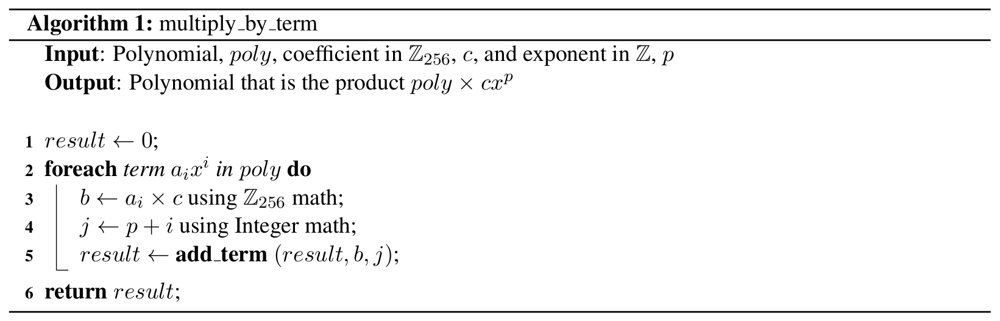
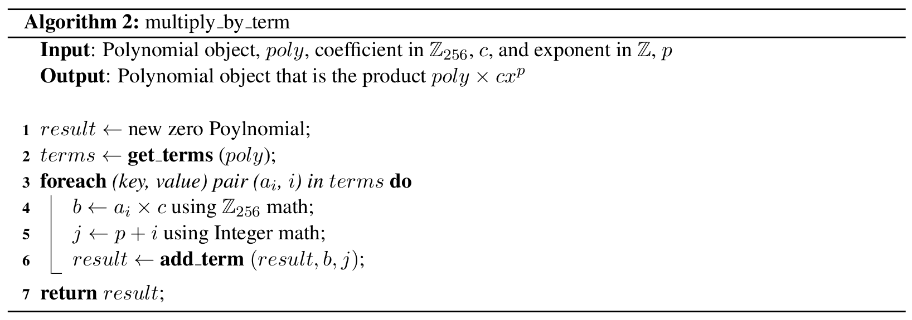
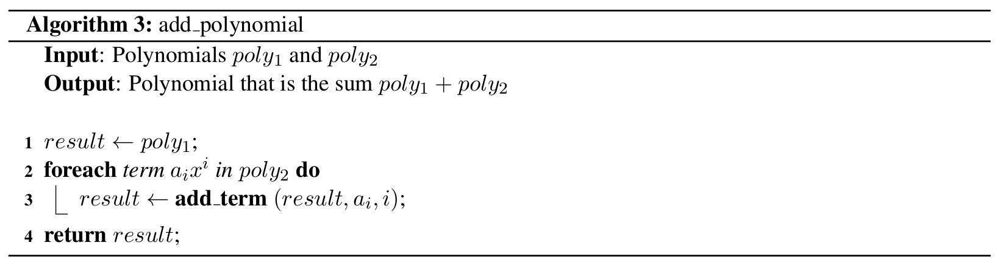
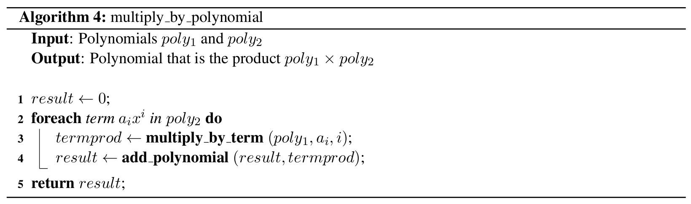
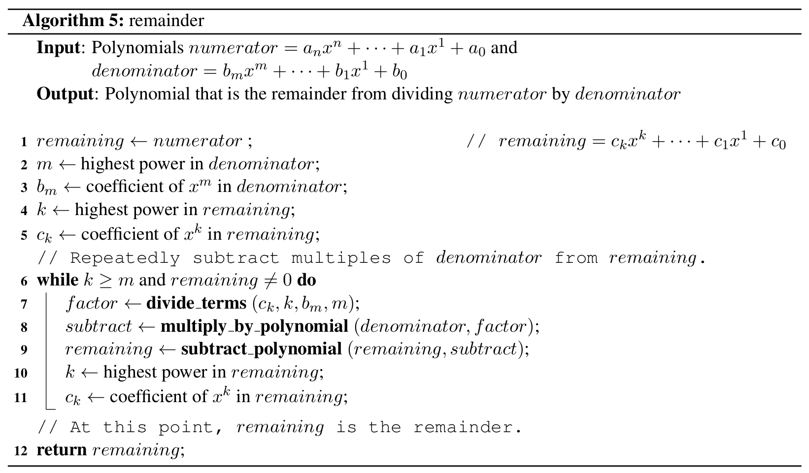

# QR Code Writeup Solutions

## 3.C.i. Multiply by Term Recipe

### Abstract Mathematical Approach

**Algorithm: multiply_by_term**

**Input:**
- Polynomial *poly*
- Coefficient in $\mathbb{Z}_{256}$, *c*
- Exponent in $\mathbb{Z}$, *p*

**Output:** Polynomial that is the product $poly \times cx^p$

1. *result* ← 0
2. **foreach** term $a_i x^i$ in *poly* **do**
   1. $b$ ← $a_i \times c$ using $\mathbb{Z}_{256}$ math
   2. $j$ ← $p + i$ using Integer math
   3. *result* ← **add_term**(*result*, *b*, *j*)
3. **return** *result*

### Class-Based Approach

**Algorithm: multiply_by_term (Class-based)**

**Input:**
- Polynomial object *poly*
- Coefficient in $\mathbb{Z}_{256}$, *c*
- Exponent in $\mathbb{Z}$, *p*

**Output:** Polynomial object that is the product $poly \times cx^p$

1. *result* ← new zero Polynomial
2. *terms* ← **get_terms**(*poly*)
3. **foreach** (key, value) pair $(a_i, i)$ in *terms* **do**
   1. $b$ ← $a_i \times c$ using $\mathbb{Z}_{256}$ math
   2. $j$ ← $p + i$ using Integer math
   3. *result* ← **add_term**(*result*, *b*, *j*)
4. **return** *result*

---

## 4.A.i. Polynomial Addition Recipe

**Algorithm: add_polynomial**

**Input:** Polynomials $poly_1$ and $poly_2$

**Output:** Polynomial that is the sum $poly_1 + poly_2$

1. *result* ← $poly_1$
2. **foreach** term $a_i x^i$ in $poly_2$ **do**
   - *result* ← **add_term**(*result*, $a_i$, $i$)
3. **return** *result*

---

## 4.C.i. Polynomial Multiplication Recipe

**Algorithm: multiply_by_polynomial**

**Input:** Polynomials $poly_1$ and $poly_2$

**Output:** Polynomial that is the product $poly_1 \times poly_2$

1. *result* ← 0
2. **foreach** term $a_i x^i$ in $poly_2$ **do**
   1. *termprod* ← **multiply_by_term**($poly_1$, $a_i$, $i$)
   2. *result* ← **add_polynomial**(*result*, *termprod*)
3. **return** *result*

---

## 4.D.i. Polynomial Remainder Recipe

**Algorithm: remainder**

**Input:**
- Polynomials *numerator* = $a_n x^n + \cdots + a_1 x^1 + a_0$ and *denominator* = $b_m x^m + \cdots + b_1 x^1 + b_0$

**Output:** Polynomial that is the remainder from dividing *numerator* by *denominator*

1. *remaining* ← *numerator*  // *remaining* = $c_k x^k + \cdots + c_1 x^1 + c_0$
2. $m$ ← highest power in *denominator*
3. $b_m$ ← coefficient of $x^m$ in *denominator*
4. $k$ ← highest power in *remaining*
5. $c_k$ ← coefficient of $x^k$ in *remaining*
6. // Repeatedly subtract multiples of *denominator* from *remaining*
7. **while** $k \geq m$ **and** *remaining* ≠ 0 **do**
   1. *factor* ← **divide_terms**($c_k$, $k$, $b_m$, $m$)
   2. *subtract* ← **multiply_by_polynomial**(*denominator*, *factor*)
   3. *remaining* ← **subtract_polynomial**(*remaining*, *subtract*)
   4. $k$ ← highest power in *remaining*
   5. $c_k$ ← coefficient of $x^k$ in *remaining*
8. // At this point, *remaining* is the remainder
9. **return** *remaining*

---

## Discussion

It is not possible to guarantee that the remainder from dividing the message by the generator polynomial will not have zero coefficients. It is possible that some of the coefficients of our remainder polynomial could be zeros, and thus not be visible in most representations of the polynomial. For instance, if the message data consists of all zeros, then the remainder must be zero, with only one term and coefficient.

We can't stop this by putting bounds on $n$ or $k$ — no matter what they are, getting coefficients that are $0$ is still possible (for instance, the message of all zeros). What we can do, however, is to interpret the "missing" coefficients as zero: for instance, if $k = 5$ and we receive the remainder $3x^4 + 8x^2 + 4$, we can rewrite as $3x^4 + 0x^3 + 8x^2 + 0x + 4$ to get correction bytes $[3, 0, 8, 0, 4]$. This is not a problem, because $0$ is a perfectly legitimate correction byte that is just as valid and useful as any other correction byte.

**Reusing code for different arithmetic:**

The easiest way to reuse the code we have already written would be to change the module we use for arithmetic.

It doesn't matter to the `Polynomial` class that we use the `z256` module for arithmetic: we can instead import the module as `import comp140_module5_z256 as arithmetic`, and update all of the references to that module in the solution.

Now that our `Polynomial` class doesn't know or care which arithmetic module it's using, we can write a `decimal_arithmetic` module that implements the same functions as `z256` except for regular integers or floats, and then change our import to `import decimal_arithmetic as arithmetic`.

Note, however, that subtraction is not the same as addition. So, any code that was written to take advantage of that fact in $\mathbb{Z}_{256}$ would need to be rewritten. The rewritten code could easily be made to work in both $\mathbb{Z}_{256}$ and $\mathbb{R}$.

In this way, we have completely changed our polynomial implementation to use a different form of arithmetic without making any real changes to the methods we implemented.
